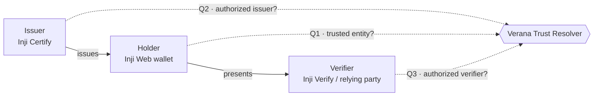
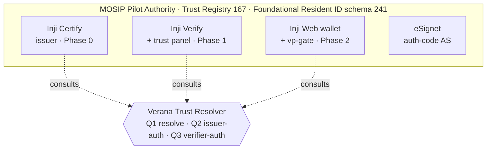
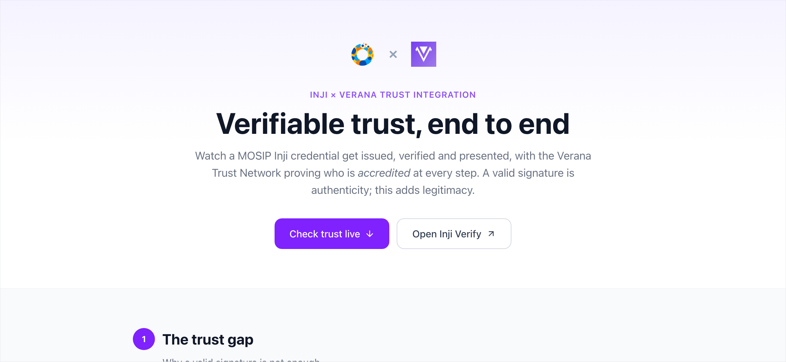
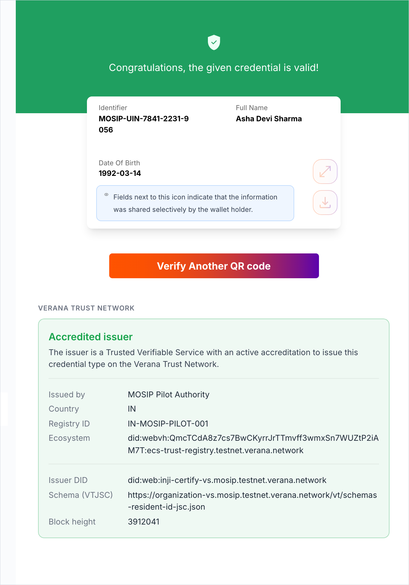

<p align="center">
  <picture>
    <source media="(prefers-color-scheme: dark)" srcset="docs/assets/mosip-x-verana-dark.png">
    
  </picture>
</p>

<h1 align="center">MOSIP × Verana</h1>

<p align="center"><b>Verifiable trust for MOSIP Inji credentials, on the Verana Trust Network.</b></p>

<p align="center">
  Real MOSIP <a href="https://docs.inji.io/">Inji</a> components, a thin Verana trust layer on top.<br>
  A valid signature proves a credential is <i>authentic</i>. Verana proves the issuer and verifier are <i>legitimate</i>.
</p>

<p align="center">
  <a href="https://playground.mosip.testnet.verana.network"></a>
  
  
  
  <a href="LICENSE"></a>
</p>

<p align="center">
  <a href="https://playground.mosip.testnet.verana.network"><b>▶ Playground</b></a> ·
  <a href="#why-this-exists">Why</a> ·
  <a href="#the-four-phases">Phases</a> ·
  <a href="#architecture">Architecture</a> ·
  <a href="#see-it-working">See it working</a> ·
  <a href="#deploy">Deploy</a> ·
  <a href="docs/">Docs</a>
</p>

---

## Why this exists

A digitally signed credential tells you the data wasn't tampered with. It does **not** tell you whether the
issuer is a real, accredited authority, or whether the verifier asking for your data is one you should trust.
That gap is where fraud and over-collection live.

This repository wires the **Verana Trust Network** into the **MOSIP Inji** stack so that, at every point in the
credential lifecycle, a participant can ask the chain *"is this party actually trusted, and authorized for this
exact credential?"* and get a fail-closed answer, before anything sensitive is issued, presented, or accepted.

> [!IMPORTANT]
> Every trust check **fails closed**: unknown, untrusted, or unauthorized always means *deny*, never *allow*.
> A valid signature is necessary but never sufficient.

It is built and run as a public pilot on the Verana testnet (`vna-testnet-1`) under a demonstration ecosystem,
the **MOSIP Pilot Authority**.

## The four phases

Each phase is a real, independently verifiable step. The deep design → runbook → live-state write-up for each
lives in [`docs/`](docs/).

| Phase | What it proves | Built on | Docs |
|---|---|---|---|
| **0 — Issuer** | Inji Certify issues a **Foundational Resident ID** under the MOSIP Pilot Authority's trust registry; it resolves as TRUSTED + an authorized issuer. | Inji Certify + eSignet | [PHASE-0](docs/PHASE-0.md) |
| **1 — Verify the issuer** | Inji Verify checks the credential, then a Verana add-on shows *who issued it and whether they're accredited* — fail-closed on untrusted/unauthorized. | Inji Verify (verify-service + UI) | [PHASE-1](docs/PHASE-1.md) |
| **2 — Protect the holder** | Before an Inji Web wallet presents a credential over OpenID4VP, it asks Verana whether the **relying party** is a trusted, authorized verifier, and **blocks** unknown or over-asking verifiers. | Inji Web wallet + eSignet | [PHASE-2](docs/PHASE-2.md) |
| **3 — Governance & economics** | A **grantor** accredits a second issuer with no transaction from the ecosystem root; trust deposits, issuance/verification **fees + permission sessions**, slashing, revocation, an **EGF**, and a **second ecosystem** are all exercised on-chain. | Verana chain (`veranad`) | [PHASE-3](docs/PHASE-3.md) |

The trust triangle the phases close — issuer, holder and verifier, each checked against the Verana resolver:



## Architecture

The guiding principle is **integrate, don't fork**. Every MOSIP component runs from its official image,
unmodified. Verana trust is layered on as additive pieces: **browser-side trust widgets** that hook the Inji
UI's network calls and render a verdict (the Inji Verify trust panel, the Inji Web wallet gate), plus
**on-chain registration + a Trust Resolver** the components consult.



| Component | Role | Host |
|---|---|---|
| `organization-vs` | MOSIP Pilot Authority (trust registry, schema, ECS) | `organization-vs.mosip.testnet.verana.network` (VS Agent API) |
| `inji-certify-vs` | Issuer — Inji Certify | OID4VCI API under `inji-certify-vs.mosip.testnet.verana.network/v1/certify` |
| `verify-service-vs` | Inji Verify backend + the Verana verifier DID | API under `inji-verify.mosip.testnet.verana.network/v1/verify` (e.g. `…/did.json`) |
| `inji-verify-ui` | Inji Verify UI + Verana trust panel — **the page to open** | `inji-verify-ui.mosip.testnet.verana.network` |
| `esignet-vs` | eSignet (OIDC AS for the wallet download flow) | API under `esignet-vs.mosip.testnet.verana.network/v1/esignet` · login UI `esignet-ui-vs…` |
| `inji-web-vs` | Inji Web wallet + the `verana-vp-gate` add-on — **the holder wallet** | `inji-web.mosip.testnet.verana.network` |
| Verana Trust Resolver | Trust evaluation consumed by the above | `resolver.testnet.verana.network/v1/trust` |

> [!NOTE]
> Only the UIs (`inji-verify-ui`, `inji-web`, `esignet-ui-vs`) render in a browser; the rest are APIs/backends, so their
> bare hostnames aren't meant to be opened directly.

The Trust Resolver answers three questions, and the integration **fails closed** on all of them:

- **Q1 `resolve`** — is this DID a trusted entity in the network?
- **Q2 `issuer-authorization`** — is this issuer authorized for this exact credential type?
- **Q3 `verifier-authorization`** — is this verifier authorized to request it?

## See it working

> [!TIP]
> **The fastest way to explore the whole integration is the hosted playground —
> [playground.mosip.testnet.verana.network](https://playground.mosip.testnet.verana.network).** It walks
> through phases 0–3 and has a **live trust-verdict widget**: pick a party, see the real resolver verdict
> (accredited issuer · authorized verifier · untrusted · not-accredited). No setup.

<p align="center">
  <a href="https://playground.mosip.testnet.verana.network"></a>
</p>

Prefer the raw surfaces?

- **Verify a credential** on **[Inji Verify](https://inji-verify-ui.mosip.testnet.verana.network)** — upload a
  Resident ID QR and watch the MOSIP result next to the Verana panel; sample QRs for every outcome are in
  [`docs/test-qrs/`](docs/test-qrs/):

<p align="center">
  
</p>

- **Ask the resolver yourself:**

```bash
curl -sG https://resolver.testnet.verana.network/v1/trust/issuer-authorization \
  --data-urlencode 'did=did:web:inji-certify-vs.mosip.testnet.verana.network' \
  --data-urlencode 'vtjscId=https://organization-vs.mosip.testnet.verana.network/vt/schemas-resident-id-jsc.json'
# -> {"authorized": true, ...}
```

- **Hold & present a credential** in the hosted **[Inji Web wallet](https://inji-web.mosip.testnet.verana.network)** — sign
  in, download the Foundational Resident ID, and the `verana-vp-gate` add-on checks the relying party against Verana
  (Q1 + Q3) and blocks unknown or over-asking verifiers before anything is shared. The Phase-2 walk-through is in
  [PHASE-2](docs/PHASE-2.md).

## Repository layout

```
organization-vs/      MOSIP Pilot Authority: trust registry, schema, ECS credentials
inji-certify-vs/      Phase 0 — Inji Certify issuer (config + deploy)
verify-service-vs/    Phase 1 — Inji Verify backend + the verifier did:web edge
inji-verify-ui/       Phase 1 — Inji Verify UI + public/verana-trust-panel.js add-on
esignet-vs/           Phase 2 — eSignet (OIDC AS) + mock identities + wallet client
inji-web-vs/          Phase 2 — Inji Web wallet (hosted) + mimoto backend + public/verana-vp-gate.js add-on
playground/           Hosted showcase walkthrough → playground.mosip.testnet.verana.network
common/               Shared shell helpers (network config, veranad, VS Agent API)
docs/                 PHASE-0..3 design/runbook/state + assets
```

> [!NOTE]
> This repo is forked from [`verana-demos`](https://github.com/hologram-verifiable-services/verana-demos).
> The inherited AnonCreds services (`issuer-chatbot-vs`, `issuer-web-vs`, `verifier-chatbot-vs`,
> `verifier-web-vs`) are the upstream base and are **not** part of the MOSIP integration. `playground/` started as
> that upstream seed and is now the MOSIP × Verana showcase UI ([issue #2](https://github.com/verana-labs/mosip-playground/issues/2)),
> live at `playground.mosip.testnet.verana.network`.

## Deploy

Deployment is **push-to-`main`, path-filtered per service** (GitHub Actions → OVH Kubernetes, namespace
`mosip`). Editing a service's directory and pushing redeploys only that service.

| Workflow | Service | Trigger path |
|---|---|---|
| `1_deploy-organization-vs` | MOSIP Pilot Authority | `workflow_dispatch` (bootstrap) |
| `7_deploy-inji-certify-vs` | Inji Certify | `inji-certify-vs/**` |
| `9_deploy-verify-service` | Inji Verify backend | `verify-service-vs/**` |
| `10_deploy-inji-verify-ui` | Inji Verify UI | `inji-verify-ui/**` |
| `11_deploy-esignet-vs` | eSignet | `esignet-vs/**` |

(Workflows `2`–`6` belong to the inherited verana-demos base.)

## Links

- **Verana** — [docs](https://docs.verana.io) · [spec](https://github.com/verana-labs/verana-spec) · [Trust Resolver](https://github.com/verana-labs/verre)
- **MOSIP Inji** — [docs](https://docs.inji.io) · [Inji Certify](https://docs.inji.io/inji-certify) · [Inji Verify](https://docs.inji.io/inji-verify) · [Inji Web](https://docs.inji.io/inji-web)
- **This integration** — phase write-ups in [`docs/`](docs/); the parent analysis + specs live in
  [`verana-labs/integration-sandbox`](https://github.com/verana-labs/integration-sandbox) under `mosip/`.
</content>
